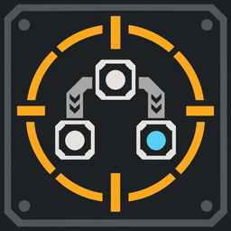
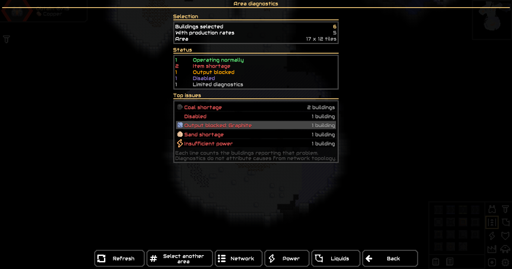
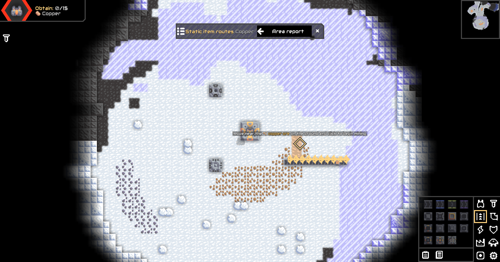
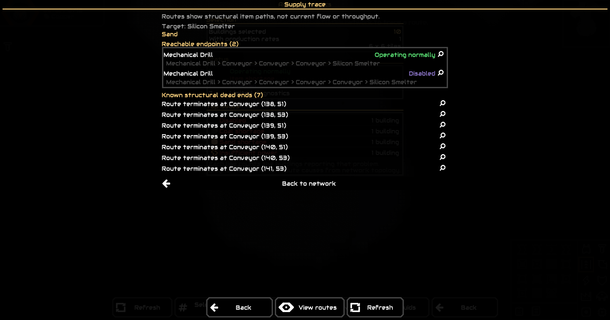
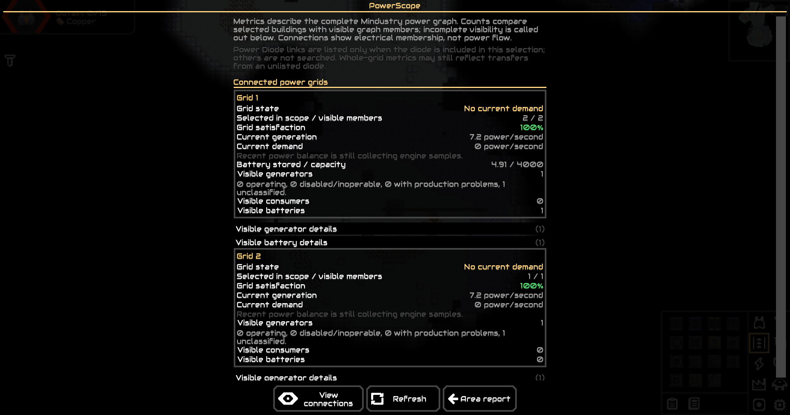
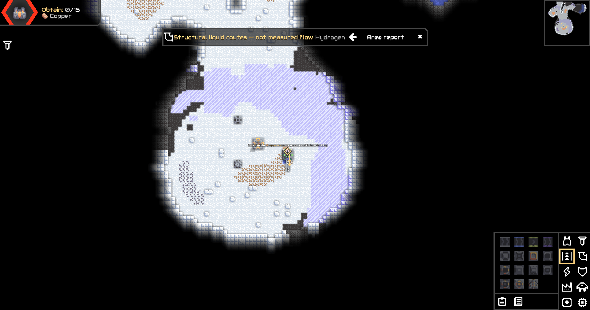
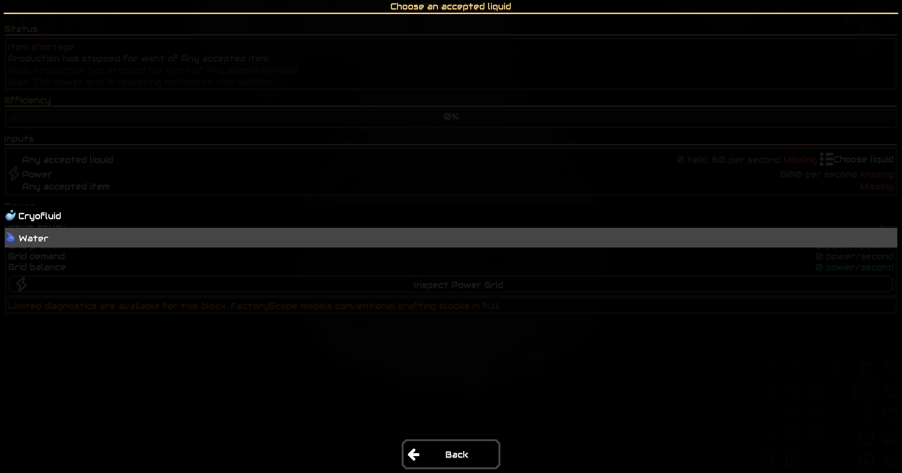

# FactoryScope

<p align="center">
  
  <br>
  <strong>Read-only diagnostics and troubleshooting for Mindustry factories.</strong>
  <br><br>
  <a href="https://github.com/Jovinull/FactoryScope/releases/latest">Latest release</a>
  &middot;
  <a href="https://github.com/Jovinull/FactoryScope/issues">Report an issue</a>
  &middot;
  <a href="docs/support-matrix.md">Support matrix</a>
</p>

FactoryScope helps you understand a building's current state and inspect the item, power, and
liquid systems around it. It reads Mindustry's exposed state and conservative structural models; it
does not change blocks, inventories, power, or the world.

## What it includes

- **Building diagnostics** for operating state, recognized input shortages, output limits, and
  supported production estimates.
- **Area Diagnostics** to summarize selected friendly buildings and group their current findings.
- **Network** to inspect supported, resource-aware item routes in a selected area.
- **Supply Trace** to follow structural item routes to reachable producers, storage, boundaries, and
  unsupported transport.
- **PowerScope** to inspect Mindustry's power graphs and their current grid-level metrics.
- **LiquidScope** to inspect supported liquid and gas routes, producers, consumers, and stored
  liquids.

Where relevant, reports provide **Locate**, **Inspect**, **Return**, and **Refresh** actions to move
between evidence without losing the current report context.

## Screenshots

These are unedited captures of FactoryScope's production UI in Mindustry v160.5.

<table>
  <tr>
    <td width="50%"><br><sub>Area Diagnostics groups current building findings.</sub></td>
    <td width="50%"><br><sub>Network shows supported structural item routes.</sub></td>
  </tr>
  <tr>
    <td width="50%"><br><sub>Supply Trace preserves multiple reachable endpoints and dead ends.</sub></td>
    <td width="50%"><br><sub>PowerScope reports grid-level state, not per-wire flow.</sub></td>
  </tr>
  <tr>
    <td width="50%"><br><sub>LiquidScope also handles Mindustry gas resources by exact content identity.</sub></td>
    <td width="50%"><br><sub>Filter consumers expose the accepted liquid choices.</sub></td>
  </tr>
</table>

## Install

**Mod Browser:** search for FactoryScope and install it. The listing is generated from GitHub and may
take a scheduled index refresh to reflect a new release.

**GitHub Releases:** download [`FactoryScope.jar`](https://github.com/Jovinull/FactoryScope/releases/latest)
and import it from Mindustry's Mods menu. This is the manual fallback if the browser listing has not
updated yet. There is no Steam Workshop release at this time.

## Use

In a game, activate the FactoryScope button below the wave/editor HUD layout area. Click a building
for its current diagnostics, or drag a rectangle for Area Diagnostics. Open Network, PowerScope, or
LiquidScope from the area report, then trace a resource where supported. Use **Locate**, **Inspect**,
and **Return** to navigate; use **Refresh** to rebuild snapshot evidence after the factory changes.

FactoryScope includes translations in English, Portuguese (Brazil), Russian, Simplified Chinese,
Korean, and Spanish. Localization terminology follows Mindustry v160.5 where applicable; see the
[localization glossary](docs/localization.md). Contributions and corrections are welcome through
the issue tracker.

## What the evidence means

The single-building inspector refreshes while open. Area Diagnostics, Network, Supply Trace,
PowerScope, and LiquidScope reports are snapshots; **Refresh** reconstructs their evidence.

Item and liquid routes mean **structural possibility**, not current movement. PowerScope reports
engine-maintained grid metrics; an electrical connection is not a measurement of flow through a
wire. A reachable producer does not prove quantitative supply sufficiency or explain the cause of a
building's state.

FactoryScope does not measure per-edge item or liquid throughput, per-wire power flow, future
battery depletion, or quantitative supply sufficiency. It does not rank root causes or recommend
repairs. Unsupported and partial transport remains visibly incomplete rather than being guessed as a
valid route or a proven dead end.

## Support and validation

FactoryScope targets Mindustry v8 Build 160 (`minGameVersion: 160`); the real-client validation build
is v160.5. The [support matrix](docs/support-matrix.md) lists modeled, partial, and deferred transport
families. Common conveyor/conduit routes, junctions, routers, sorters, configured item bridges, and
the v160.5 Armored Conveyor/Armored Duct insertion rules are modeled. Stateful stack transports,
unloaders, Duct Bridges, Mass Drivers, armored conduits, and liquid bridges remain partial; unknown
custom routing stays conservative.

Desktop graphical acceptance has been performed on Windows. Launcher/path tests run on Windows,
Linux, and macOS; that is not graphical validation on those platforms. The universal JAR contains a
structurally validated DEX, but Android runtime and touch have not been independently validated.
Remote multiplayer behavior has not been independently validated. See
[open Android validation issue #1](https://github.com/Jovinull/FactoryScope/issues/1).

## Bug reports and development

When [reporting a bug](https://github.com/Jovinull/FactoryScope/issues/new), include the Mindustry
build, steps to reproduce, and a screenshot or relevant log excerpt when possible. The project favors
reproducible tests and engine-backed evidence over speculative fixes.

Builds require JDK 17. The Gradle wrapper downloads the pinned build dependencies.

```text
gradlew.bat clean test acceptanceLauncherTest jar acceptanceJar verifyArtifacts  # Windows
./gradlew clean test acceptanceLauncherTest jar acceptanceJar verifyArtifacts    # Linux/macOS
gradlew.bat acceptanceTest                                                       # Windows
./gradlew acceptanceTest                                                        # Linux/macOS
```

`acceptanceTest` launches a real Mindustry v160.5 desktop client in an isolated sandbox. For an
explicit client and artifact:

```text
./gradlew acceptanceTest -PmindustryJar="/games/Mindustry.jar" -PmodJar="/artifacts/FactoryScope.jar" -Plocale=pt-BR
```

`jar` builds the desktop JAR. The universal release JAR, including `classes.dex`, is built by `deploy`
with Android build tools available. Informational benchmarks are `areaBenchmark`, `networkBenchmark`,
`traceBenchmark`, `powerBenchmark`, and `liquidBenchmark`; they have no timing pass/fail thresholds.
See [testing](docs/testing.md), [architecture](docs/architecture.md), and [release procedure](docs/releasing.md).

## License

FactoryScope is licensed under [GPL-3.0](LICENSE).
